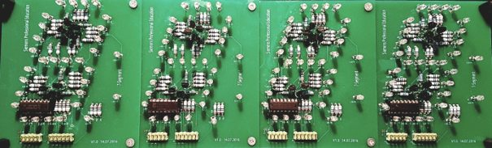

# 7-Segment

## Sinn und Zweck

Es soll eine Aufgabe entwickelt werden, bei der die Lötfähigkeiten trainiert und angewendet werden können. 
Der Umfang der Aufgabe sollte dabei in einem angemessenen Masse liegen, welche für das erste Lehrjahr realisierbar ist.

## Grobkonzept

Das Ziel ist es, eine 7-Segment-Anzeige mit einzelnen LEDs zu entwickeln. Die Segmente sollen einzeln und zusätzlich über einen Decoder angesteuert werden können. 
Das Ganze besteht aus den sieben Einzelsegmenten, einem Dezimalpunkt und zwei LEDs, welche einen Doppelpunkt bilden.

## Schaltungsentwicklung

### LED Ansteuerung

#### Beschreibung

Die einzelnen Segmente der Anzeige bestehen aus jeweils vier LEDs, welche einzeln mit einem Vorwiderstand beschaltet werden. Als Treiber wird ein einfacher BC547 Transistor verwendet. 
Das Steuersignal um das Segment anzusteuern liegt bei 5VDC. Die Speisung der LEDs erfolgt ebenfalls mit 5VDC.

