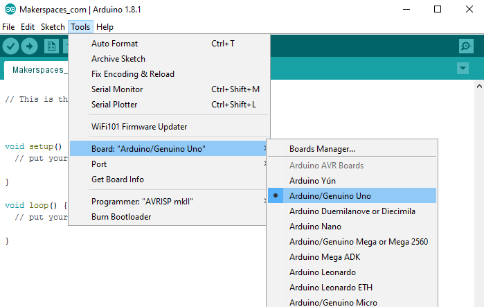
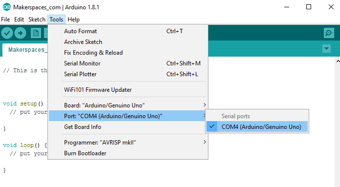

# Getting Started

Before you can start working with Arduino, you need to make sure you have the IDE software installed on your computer. 
This program allows you to write, view and upload the code to your Arduino Uno board.  You can download the IDE for free on Arduino’s website.

Once the IDE is installed, you will need to connect your Arduino to your computer.  
To do this, plug one end of the USB cable to the Arduino Uno and then the other end of the USB to your computer’s USB port.

## Select The Board

Once the board is plugged in, you will need to open the IDE and click on **Tools > Board > Arduino Uno** to select the board.

## Select Serial Port

Next, you have to tell the Arduino which port you are using on your computer.  To select the port, go to **Tools > Port** and then select the port that says **Arduino**.

